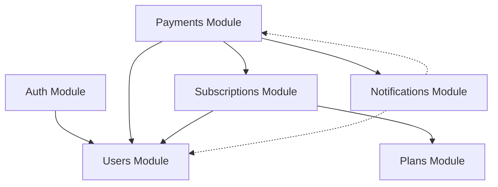

## Module Overview

DevTools Hub API is organized into six core business modules, each following the hexagonal architecture pattern:

<CardGroup cols={3}>
  <Card title="Auth" icon="shield-halved">
    Authentication & authorization
  </Card>
  <Card title="Users" icon="users">
    User management
  </Card>
  <Card title="Plans" icon="layer-group">
    Subscription plans
  </Card>
  <Card title="Subscriptions" icon="calendar-check">
    User subscriptions
  </Card>
  <Card title="Payments" icon="credit-card">
    Payment processing
  </Card>
  <Card title="Notifications" icon="bell">
    Notification system
  </Card>
</CardGroup>

## Module Structure Template

Each module follows a consistent structure:

```
modules/{module-name}/
├── domain/
│   ├── entities/           # Business entities
│   └── repositories/       # Repository interfaces
├── application/
│   ├── services/           # Application services
│   └── use-cases/          # Business use cases
├── infrastructure/
│   ├── controllers/        # HTTP controllers
│   ├── persistence/        # Repository implementations
│   ├── mappers/            # Entity-DTO mappers
│   ├── adapters/           # External service adapters
│   └── security/           # Guards, strategies (auth only)
├── presentation/
│   └── dto/                # Data Transfer Objects
└── {module}.module.ts      # NestJS module definition
```

## Payments Module

Handles all payment-related operations including creation, confirmation, and refunds.

<Tabs>
  <Tab title="Structure">
    ```
    modules/Payments/
    ├── domain/
    │   ├── entities/
    │   │   └── payment.entity.ts
    │   └── repositories/
    │       └── payment.repository.ts
    ├── application/
    │   ├── services/
    │   │   └── payment.service.ts
    │   └── use-cases/
    │       ├── create-payment.use-case.ts
    │       ├── confirm-payment.use-case.ts
    │       ├── refund-payment.use-case.ts
    │       └── get-payments-by-user.use-case.ts
    ├── infrastructure/
    │   ├── controllers/
    │   │   └── payment.controller.ts
    │   ├── persistence/
    │   │   └── payment.repository.impl.ts
    │   └── mappers/
    │       └── payment.mapper.ts
    ├── presentation/
    │   └── dto/
    │       ├── create-payment.dto.ts
    │       ├── confirm-payment.dto.ts
    │       └── payment-response.dto.ts
    └── payment.module.ts
    ```
  </Tab>
  
  <Tab title="Domain">
    **Payment Entity**
    
    ```typescript
    @Entity({ name: 'payments' })
    export class PaymentEntity {
      @PrimaryGeneratedColumn()
      id: number;
    
      @ManyToOne(() => UserEntity)
      user: UserEntity;
    
      @ManyToOne(() => SubscriptionEntity)
      subscription: SubscriptionEntity;
    
      @Column({ type: 'decimal', precision: 10, scale: 2 })
      amount: number;
    
      @Column({ default: 'pending' })
      status: 'pending' | 'completed' | 'failed' | 'refunded';
    
      @Column({ nullable: true })
      method?: string;
    
      @CreateDateColumn({ name: 'created_at' })
      createdAt: Date;
    }
    ```
    
    **Repository Interface**
    
    ```typescript
    export abstract class PaymentRepository {
      abstract save(payment: PaymentEntity): Promise<PaymentEntity>;
      abstract findById(id: number): Promise<PaymentEntity | null>;
      abstract findByUser(userId: string): Promise<PaymentEntity[]>;
      abstract update(payment: PaymentEntity): Promise<PaymentEntity>;
    }
    ```
  </Tab>
  
  <Tab title="Use Cases">
    **Available Use Cases:**
    
    - `CreatePaymentUseCase` - Create a new payment
    - `ConfirmPaymentUseCase` - Confirm payment completion
    - `RefundPaymentUseCase` - Process payment refund
    - `GetPaymentsByUserUseCase` - Retrieve user's payment history
    
    **Example: Create Payment**
    
    ```typescript
    @Injectable()
    export class CreatePaymentUseCase {
      constructor(
        @Inject('PaymentRepository')
        private readonly paymentRepository: PaymentRepository,
        @Inject('UserRepository')
        private readonly userRepository: UserRepository,
        @Inject('SubscriptionRepository')
        private readonly subscriptionRepository: SubscriptionRepository,
      ) {}
    
      async execute(
        userId: string,
        subscriptionId: number,
        amount: number,
        method?: string
      ): Promise<PaymentEntity> {
        const user = await this.userRepository.findById(userId);
        if (!user) throw new NotFoundException('User not found');
    
        const subscription = await this.subscriptionRepository.findById(subscriptionId);
        if (!subscription) throw new NotFoundException('Subscription not found');
    
        const payment = new PaymentEntity();
        payment.user = user;
        payment.subscription = subscription;
        payment.amount = amount;
        payment.method = method || 'manual';
        payment.status = 'pending';
    
        return this.paymentRepository.save(payment);
      }
    }
    ```
  </Tab>
  
  <Tab title="API Endpoints">
    **Base Path:** `/payments`
    
    | Method | Endpoint | Description |
    |--------|----------|-------------|
    | POST | `/payments` | Create new payment |
    | GET | `/payments/:userId` | Get user's payments |
    | PATCH | `/payments/:id/confirm` | Confirm payment |
    | PATCH | `/payments/:id/refund` | Refund payment |
  </Tab>
</Tabs>

## Auth Module

Handles authentication, authorization, and JWT token management.

<Tabs>
  <Tab title="Structure">
    ```
    modules/auth/
    ├── application/
    │   ├── services/
    │   │   └── auth.service.ts
    │   └── use-cases/
    │       ├── login.use-case.ts
    │       └── register.use-case.ts
    ├── infrastructure/
    │   ├── controllers/
    │   │   └── auth.controller.ts
    │   ├── mappers/
    │   │   └── user.mapper.ts
    │   └── security/
    │       ├── jwt.strategy.ts
    │       └── jwt-auth.guard.ts
    ├── presentation/
    │   └── dto/
    │       ├── login.dto.ts
    │       ├── register.dto.ts
    │       └── response.dto.ts
    └── auth.module.ts
    ```
  </Tab>
  
  <Tab title="Security">
    **JWT Strategy**
    
    ```typescript
    @Injectable()
    export class JwtStrategy extends PassportStrategy(Strategy) {
      constructor() {
        super({
          jwtFromRequest: ExtractJwt.fromAuthHeaderAsBearerToken(),
          ignoreExpiration: false,
          secretOrKey: process.env.JWT_SECRET || 'secretKey',
        });
      }
    
      async validate(payload: any) {
        return { userId: payload.sub, email: payload.email };
      }
    }
    ```
    
    **JWT Auth Guard**
    
    Apply to protected routes:
    
    ```typescript
    @UseGuards(JwtAuthGuard)
    @Get('profile')
    getProfile(@Request() req) {
      return req.user;
    }
    ```
  </Tab>
  
  <Tab title="Use Cases">
    **Available Use Cases:**
    
    - `LoginUseCase` - Authenticate user and generate JWT
    - `RegisterUseCase` - Create new user account
    
    **Login Flow:**
    
    <Steps>
      <Step title="Validate Credentials">
        Verify email and password against database
      </Step>
      <Step title="Generate Token">
        Create JWT with user information
      </Step>
      <Step title="Return Response">
        Send token and user data to client
      </Step>
    </Steps>
  </Tab>
  
  <Tab title="API Endpoints">
    **Base Path:** `/auth`
    
    | Method | Endpoint | Description |
    |--------|----------|-------------|
    | POST | `/auth/register` | Register new user |
    | POST | `/auth/login` | Authenticate user |
  </Tab>
</Tabs>

## Users Module

Manages user profiles and account information.

<Tabs>
  <Tab title="Structure">
    ```
    modules/user/
    ├── domain/
    │   ├── user.entity.ts
    │   └── repositories/
    │       └── user.repository.ts
    ├── application/
    │   ├── services/
    │   │   └── user.service.ts
    │   └── use-cases/
    │       ├── get-all-users.use-case.ts
    │       ├── get-user-by-id.use-case.ts
    │       ├── update-user.use-case.ts
    │       └── delete-user.use-case.ts
    ├── infrastructure/
    │   ├── controllers/
    │   │   └── user.controller.ts
    │   └── persistence/
    │       └── user.repository.impl.ts
    └── user.module.ts
    ```
  </Tab>
  
  <Tab title="Domain">
    **User Entity**
    
    ```typescript
    @Entity({ name: 'users' })
    export class UserEntity {
      @PrimaryGeneratedColumn()
      id: string;
    
      @Column({ unique: true })
      email: string;
    
      @Exclude()
      @Column()
      password: string;
    
      @Column({ nullable: true })
      name?: string;
    
      @Column({ nullable: true, name: 'plan_activo' })
      activePlan?: string;
    
      @CreateDateColumn({ name: 'fecha_registro' })
      registrationDate: string;
    }
    ```
    
    <Note>
      The `@Exclude()` decorator ensures the password is never serialized in responses.
    </Note>
  </Tab>
  
  <Tab title="Use Cases">
    **Available Use Cases:**
    
    - `GetAllUsersUseCase` - List all users
    - `GetUserByIdUseCase` - Get specific user
    - `UpdateUserUseCase` - Update user information
    - `DeleteUserUseCase` - Delete user account
  </Tab>
  
  <Tab title="API Endpoints">
    **Base Path:** `/users`
    
    | Method | Endpoint | Description |
    |--------|----------|-------------|
    | GET | `/users` | Get all users |
    | GET | `/users/:id` | Get user by ID |
    | PATCH | `/users/:id` | Update user |
    | DELETE | `/users/:id` | Delete user |
  </Tab>
</Tabs>

## Subscriptions Module

Manages user subscriptions to plans.

<Tabs>
  <Tab title="Structure">
    ```
    modules/subscriptions/
    ├── domain/
    │   ├── entities/
    │   │   └── subscription.entity.ts
    │   └── repositories/
    │       └── subscription.repository.ts
    ├── application/
    │   ├── services/
    │   └── use-cases/
    ├── infrastructure/
    │   ├── controllers/
    │   ├── persistence/
    │   └── mappers/
    ├── presentation/
    │   └── dto/
    └── subscription.module.ts
    ```
  </Tab>
  
  <Tab title="Domain">
    **Subscription Entity**
    
    ```typescript
    @Entity({ name: 'subscriptions' })
    export class SubscriptionEntity {
      @PrimaryGeneratedColumn()
      id: number;
    
      @ManyToOne(() => UserEntity)
      user: UserEntity;
    
      @ManyToOne(() => PlanEntity)
      plan: PlanEntity;
    
      @Column({ type: 'timestamp', name: 'start_date' })
      startDate: Date;
    
      @Column({ type: 'timestamp', name: 'end_date', nullable: true })
      endDate?: Date;
    
      @Column({ default: 'active' })
      status: 'active' | 'cancelled' | 'expired';
    
      @CreateDateColumn({ name: 'created_at' })
      createdAt: Date;
    
      @UpdateDateColumn({ name: 'updated_at' })
      updatedAt: Date;
    }
    ```
  </Tab>
  
  <Tab title="Relationships">
    **Subscription Dependencies:**
    
    - Belongs to a `User`
    - Belongs to a `Plan`
    - Has many `Payments`
    
    ```mermaid
    graph LR
        A[User] --> B[Subscription]
        C[Plan] --> B
        B --> D[Payment]
    ```
  </Tab>
</Tabs>

## Plans Module

Defines available subscription plans and their features.

<Tabs>
  <Tab title="Structure">
    ```
    modules/plans/
    ├── domain/
    │   ├── entities/
    │   │   └── plan.entity.ts
    │   └── repositories/
    │       └── plan.repository.ts
    ├── application/
    │   ├── services/
    │   └── use-cases/
    ├── infrastructure/
    │   ├── controllers/
    │   ├── persistence/
    │   └── mappers/
    ├── presentation/
    │   └── dto/
    └── plans.module.ts
    ```
  </Tab>
  
  <Tab title="Domain">
    **Plan Features:**
    
    - Plan name and description
    - Pricing information
    - Feature limits
    - Billing period
    
    Plans are the foundation of the subscription system.
  </Tab>
</Tabs>

## Notifications Module

Handles email notifications and event-based messaging.

<Tabs>
  <Tab title="Structure">
    ```
    modules/notifications/
    ├── domain/
    │   └── entities/
    │       └── notification.entity.ts
    ├── application/
    │   ├── services/
    │   │   └── notification.service.ts
    │   └── use-cases/
    │       ├── send-email.use-case.ts
    │       ├── send-payment-confirmation.use-case.ts
    │       └── send-subscription-change.use-case.ts
    ├── infrastructure/
    │   ├── controllers/
    │   │   └── notification.controller.ts
    │   └── adapters/
    │       └── email.adapter.ts
    ├── presentation/
    │   └── dto/
    └── notifications.module.ts
    ```
  </Tab>
  
  <Tab title="Email Adapter">
    **External Service Integration**
    
    ```typescript
    @Injectable()
    export class EmailAdapter {
      private transporter: nodemailer.Transporter;
    
      constructor() {
        this.transporter = nodemailer.createTransport({
          host: process.env.MAIL_HOST,
          port: Number(process.env.MAIL_PORT),
          secure: true,
          auth: {
            user: process.env.MAIL_USER,
            pass: process.env.MAIL_PASS,
          },
        });
      }
    
      async sendEmail(
        to: string,
        subject: string,
        message: string
      ): Promise<boolean> {
        try {
          await this.transporter.sendMail({
            from: process.env.MAIL_FROM,
            to,
            subject,
            html: this.buildEmailTemplate(message),
          });
          return true;
        } catch (error) {
          this.logger.error(`Error sending email: ${error.message}`);
          return false;
        }
      }
    }
    ```
    
    <Info>
      The email adapter is a perfect example of the Adapter pattern in hexagonal architecture - it adapts the external nodemailer library to our domain needs.
    </Info>
  </Tab>
  
  <Tab title="Use Cases">
    **Available Use Cases:**
    
    - `SendEmailUseCase` - Send generic email
    - `SendPaymentConfirmationUseCase` - Notify payment confirmation
    - `SendSubscriptionChangeUseCase` - Notify subscription changes
    
    **Event-Driven Notifications:**
    
    Other modules can trigger notifications:
    
    ```typescript
    // In payment confirmation use case
    await this.sendPaymentConfirmation.execute(
      payment.user.email,
      payment.id,
      payment.amount
    );
    ```
  </Tab>
</Tabs>

## Module Dependencies

Modules depend on each other through exported interfaces:

```typescript
// payment.module.ts
@Module({
  imports: [
    TypeOrmModule.forFeature([PaymentEntity]),
    UsersModule,              // Imports UserRepository
    SubscriptionsModule,      // Imports SubscriptionRepository
    NotificationsModule       // Imports notification services
  ],
  providers: [
    { provide: 'PaymentRepository', useClass: PaymentRepositoryImpl },
    CreatePaymentUseCase,
    // ...
  ],
  exports: ['PaymentRepository'],  // Other modules can use this
})
export class PaymentsModule {}
```

<Note>
  Modules export their repository interfaces (not implementations) to maintain loose coupling.
</Note>

## Dependency Graph



<Info>
  Solid arrows represent direct dependencies. Dashed arrows represent event-based communication.
</Info>

## Module Configuration Best Practices

<AccordionGroup>
  <Accordion title="Use Token-Based Injection" icon="key">
    Always use string tokens for repository injection:
    
    ```typescript
    { provide: 'PaymentRepository', useClass: PaymentRepositoryImpl }
    ```
    
    This allows swapping implementations without changing use cases.
  </Accordion>
  
  <Accordion title="Export Only Interfaces" icon="share">
    Export repository interface tokens, not concrete implementations:
    
    ```typescript
    exports: ['PaymentRepository']  // ✓ Good
    exports: [PaymentRepositoryImpl]  // ✗ Bad
    ```
  </Accordion>
  
  <Accordion title="Import Related Modules" icon="download">
    Import other modules to access their exported providers:
    
    ```typescript
    imports: [UsersModule, SubscriptionsModule]
    ```
  </Accordion>
  
  <Accordion title="Keep Controllers Thin" icon="weight-scale">
    Controllers should only:
    - Validate input (via DTOs)
    - Call use cases
    - Map responses
    
    Business logic belongs in use cases.
  </Accordion>
  
  <Accordion title="One Entity Per Module" icon="database">
    Each module should own exactly one aggregate root entity. Related entities can exist but should be managed through the aggregate root.
  </Accordion>
</AccordionGroup>

## Adding a New Module

<Steps>
  <Step title="Create Directory Structure">
    ```bash
    mkdir -p modules/new-module/{domain,application,infrastructure,presentation}
    mkdir -p modules/new-module/domain/{entities,repositories}
    mkdir -p modules/new-module/application/{services,use-cases}
    mkdir -p modules/new-module/infrastructure/{controllers,persistence,mappers}
    mkdir -p modules/new-module/presentation/dto
    ```
  </Step>
  
  <Step title="Define Domain Layer">
    Create entity and repository interface in the domain layer:
    
    ```typescript
    // domain/entities/resource.entity.ts
    @Entity({ name: 'resources' })
    export class ResourceEntity {
      // Entity definition
    }
    
    // domain/repositories/resource.repository.ts
    export abstract class ResourceRepository {
      abstract save(resource: ResourceEntity): Promise<ResourceEntity>;
      abstract findById(id: number): Promise<ResourceEntity | null>;
    }
    ```
  </Step>
  
  <Step title="Implement Application Layer">
    Create use cases:
    
    ```typescript
    // application/use-cases/create-resource.use-case.ts
    @Injectable()
    export class CreateResourceUseCase {
      constructor(
        @Inject('ResourceRepository')
        private readonly repository: ResourceRepository,
      ) {}
      
      async execute(data: any): Promise<ResourceEntity> {
        // Implementation
      }
    }
    ```
  </Step>
  
  <Step title="Build Infrastructure Layer">
    Implement repository and controller:
    
    ```typescript
    // infrastructure/persistence/resource.repository.impl.ts
    @Injectable()
    export class ResourceRepositoryImpl implements ResourceRepository {
      // Implementation
    }
    
    // infrastructure/controllers/resource.controller.ts
    @Controller('resources')
    export class ResourceController {
      // Implementation
    }
    ```
  </Step>
  
  <Step title="Create DTOs">
    Define presentation layer contracts:
    
    ```typescript
    // presentation/dto/create-resource.dto.ts
    export class CreateResourceDto {
      @IsNotEmpty()
      @IsString()
      name: string;
    }
    ```
  </Step>
  
  <Step title="Configure Module">
    Wire everything together:
    
    ```typescript
    @Module({
      imports: [TypeOrmModule.forFeature([ResourceEntity])],
      controllers: [ResourceController],
      providers: [
        { provide: 'ResourceRepository', useClass: ResourceRepositoryImpl },
        CreateResourceUseCase,
      ],
      exports: ['ResourceRepository'],
    })
    export class ResourceModule {}
    ```
  </Step>
  
  <Step title="Register in App Module">
    ```typescript
    // app.module.ts
    @Module({
      imports: [
        // ...
        ResourceModule,
      ],
    })
    export class AppModule {}
    ```
  </Step>
</Steps>

## Testing Strategy

<Tabs>
  <Tab title="Unit Tests">
    Test use cases with mocked repositories:
    
    ```typescript
    describe('CreatePaymentUseCase', () => {
      let useCase: CreatePaymentUseCase;
      let mockRepository: jest.Mocked<PaymentRepository>;
    
      beforeEach(() => {
        mockRepository = {
          save: jest.fn(),
          findById: jest.fn(),
        } as any;
    
        useCase = new CreatePaymentUseCase(
          mockRepository,
          mockUserRepository,
          mockSubscriptionRepository
        );
      });
    
      it('should create a payment', async () => {
        const result = await useCase.execute('user-1', 1, 99.99);
        expect(mockRepository.save).toHaveBeenCalled();
      });
    });
    ```
  </Tab>
  
  <Tab title="Integration Tests">
    Test controllers with real database:
    
    ```typescript
    describe('PaymentController', () => {
      let app: INestApplication;
    
      beforeAll(async () => {
        const module = await Test.createTestingModule({
          imports: [PaymentsModule],
        }).compile();
    
        app = module.createNestApplication();
        await app.init();
      });
    
      it('POST /payments', () => {
        return request(app.getHttpServer())
          .post('/payments')
          .send({ userId: '1', subscriptionId: 1, amount: 99.99 })
          .expect(201);
      });
    });
    ```
  </Tab>
  
  <Tab title="E2E Tests">
    Test complete workflows across modules:
    
    ```typescript
    describe('Payment Flow', () => {
      it('should create payment and send notification', async () => {
        // Create user
        const user = await createUser();
        
        // Create subscription
        const subscription = await createSubscription(user.id);
        
        // Create payment
        const payment = await createPayment(user.id, subscription.id);
        
        // Verify notification sent
        expect(emailSent).toBe(true);
      });
    });
    ```
  </Tab>
</Tabs>

## Common Patterns Across Modules

<CardGroup cols={2}>
  <Card title="Repository Pattern" icon="database">
    All modules use abstract repositories in domain with implementations in infrastructure
  </Card>
  <Card title="Use Case Pattern" icon="list-check">
    Each business operation is encapsulated in a dedicated use case class
  </Card>
  <Card title="DTO Validation" icon="shield-check">
    All input is validated using class-validator decorators on DTOs
  </Card>
  <Card title="Dependency Injection" icon="plug">
    NestJS DI container manages all dependencies with token-based injection
  </Card>
  <Card title="Mapper Pattern" icon="arrow-right-arrow-left">
    Mappers transform between domain entities and DTOs
  </Card>
  <Card title="Event-Driven" icon="bolt">
    Modules communicate via events for loose coupling (e.g., notifications)
  </Card>
</CardGroup>

## Summary

Each module in DevTools Hub API:

- Follows hexagonal architecture with four layers
- Owns a single aggregate root entity
- Exposes use cases as the public API
- Implements repositories as adapters to external storage
- Validates input at the presentation boundary
- Communicates through dependency injection
- Can be tested independently

This structure ensures maintainability, testability, and clear separation of concerns throughout the entire application.