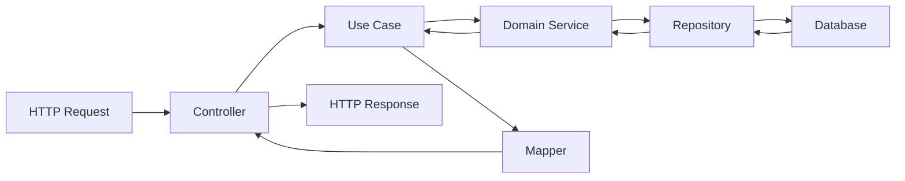

## Introduction

DevTools Hub API is built using **NestJS** following a **Hexagonal Architecture** (Ports and Adapters) pattern. This architectural approach ensures clean separation of concerns, maintainability, and testability throughout the application.

## Core Architectural Principles

<CardGroup cols={2}>
  <Card title="Domain-Driven Design" icon="circle-nodes">
    Business logic is isolated in the domain layer, independent of frameworks and external concerns
  </Card>
  <Card title="Dependency Inversion" icon="arrows-rotate">
    Dependencies point inward toward the domain, with infrastructure implementing domain interfaces
  </Card>
  <Card title="Separation of Concerns" icon="layer-group">
    Each layer has a single, well-defined responsibility with clear boundaries
  </Card>
  <Card title="Testability" icon="vial">
    Business logic can be tested independently of infrastructure and frameworks
  </Card>
</CardGroup>

## Application Structure

The application follows a modular structure where each business domain is encapsulated in its own module:

```
src/
├── app.module.ts              # Root application module
├── config/                     # Application configuration
│   └── database.config.ts
└── modules/                    # Business modules
    ├── auth/                   # Authentication & authorization
    ├── user/                   # User management
    ├── plans/                  # Subscription plans
    ├── subscriptions/          # User subscriptions
    ├── Payments/               # Payment processing
    └── notifications/          # Notification system
```

## Module Organization

Each module follows the hexagonal architecture pattern with four distinct layers:

<Steps>
  <Step title="Domain Layer">
    Contains business entities, value objects, and repository interfaces. This is the core of the application with no external dependencies.
    
    **Location:** `modules/{module}/domain/`
  </Step>
  
  <Step title="Application Layer">
    Orchestrates use cases and business workflows. Contains services and use case implementations.
    
    **Location:** `modules/{module}/application/`
  </Step>
  
  <Step title="Infrastructure Layer">
    Implements technical capabilities: database access, external services, controllers, and mappers.
    
    **Location:** `modules/{module}/infrastructure/`
  </Step>
  
  <Step title="Presentation Layer">
    Defines DTOs (Data Transfer Objects) for API input/output validation and documentation.
    
    **Location:** `modules/{module}/presentation/`
  </Step>
</Steps>

## Technology Stack

<Tabs>
  <Tab title="Framework">
    - **NestJS**: Progressive Node.js framework
    - **TypeScript**: Type-safe development
    - **Decorator-based**: Leverages TypeScript decorators for clean, declarative code
  </Tab>
  
  <Tab title="Data Layer">
    - **TypeORM**: ORM for database interactions
    - **PostgreSQL/MySQL**: Relational database support
    - **Repository Pattern**: Abstraction over data access
  </Tab>
  
  <Tab title="Validation & Security">
    - **class-validator**: DTO validation
    - **class-transformer**: Object transformation
    - **Passport.js**: Authentication strategies
    - **JWT**: Token-based authentication
  </Tab>
  
  <Tab title="Documentation">
    - **Swagger/OpenAPI**: API documentation via `@nestjs/swagger`
    - **ApiProperty decorators**: Automatic schema generation
  </Tab>
</Tabs>

## Module Dependencies

Modules communicate through well-defined interfaces and dependency injection:

```typescript
// app.module.ts
@Module({
  imports: [
    ConfigModule.forRoot({ isGlobal: true }),
    TypeOrmModule.forRootAsync({ useFactory: databaseConfig }),
    AuthModule,
    UsersModule,
    PlansModule,
    SubscriptionsModule,
    PaymentsModule,
    NotificationsModule
  ],
})
export class AppModule {}
```

<Note>
  Each module exports its repository interfaces, allowing other modules to depend on abstractions rather than concrete implementations.
</Note>

## Request Flow

A typical request flows through the layers in this order:



<Steps>
  <Step title="Request Validation">
    Controller receives HTTP request and validates it using DTOs from the presentation layer
  </Step>
  
  <Step title="Use Case Execution">
    Controller delegates to a use case in the application layer
  </Step>
  
  <Step title="Business Logic">
    Use case orchestrates domain entities and calls repository interfaces
  </Step>
  
  <Step title="Data Persistence">
    Infrastructure layer implements repositories to persist data
  </Step>
  
  <Step title="Response Mapping">
    Mappers transform domain entities to response DTOs
  </Step>
  
  <Step title="Response Delivery">
    Controller returns formatted response to the client
  </Step>
</Steps>

## Benefits of This Architecture

<AccordionGroup>
  <Accordion title="Maintainability">
    Clear separation of concerns makes it easy to locate and modify code. Business logic is isolated from infrastructure concerns.
  </Accordion>
  
  <Accordion title="Testability">
    Each layer can be tested independently. Domain logic can be tested without database or HTTP concerns.
  </Accordion>
  
  <Accordion title="Flexibility">
    Easy to swap implementations (e.g., change database, add new adapters) without affecting business logic.
  </Accordion>
  
  <Accordion title="Scalability">
    Modular design allows teams to work on different modules independently. Clear boundaries prevent tight coupling.
  </Accordion>
  
  <Accordion title="Domain Focus">
    Business rules are first-class citizens, not hidden behind framework code.
  </Accordion>
</AccordionGroup>

## Next Steps

<CardGroup cols={2}>
  <Card title="Hexagonal Architecture" icon="hexagon" href="/architecture/hexagonal-architecture">
    Deep dive into how hexagonal architecture is implemented
  </Card>
  <Card title="Module Structure" icon="cube" href="/architecture/modules">
    Detailed documentation of all modules and their responsibilities
  </Card>
</CardGroup>